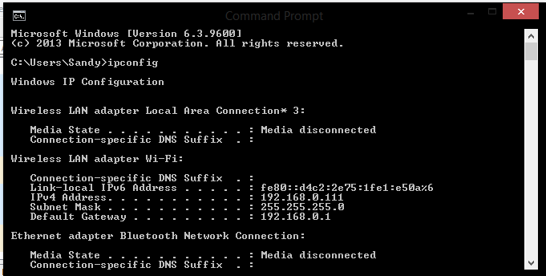
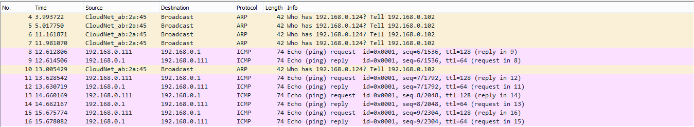
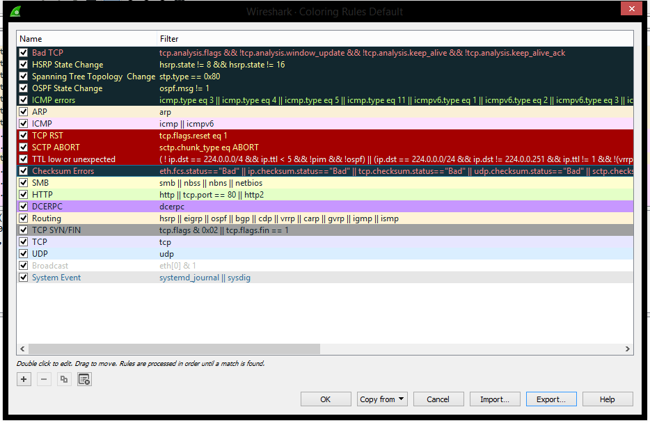
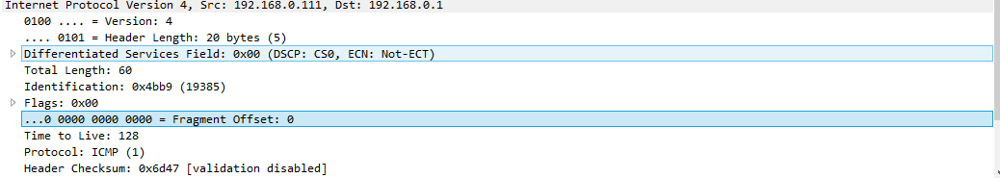

# Praktikum Jaringan Komputer

### Mengamati Jaringan Rumah

Mengetahui alamat IP pada jaringan rumah dengan menggunakan command ipconfig pada command prompt.

Pada gambar di atas didapatkan IP nya yaitu 192.168.0.1. Selanjutny kita lakukan ping pada alamat IP tersebut dengan menggunakan command ping (alamat ip).

Selanjutnya kita lihat hasil ping tersebut pada software wireshark.

Setelah itu kita amati apa arti warna dari tiap baris dengan menggunakan tabel berikut 

Berdasarkan tabel tersebut pada jaringan rumah, rata-rata bertipe ARP dan ICMP. Selanjutnya kita akan mencoba melihat isi dari ping yang kita lakukan tadi. Kita akan mengidentifikasi header ip dengan menggunakan tabel berikut

Hasil dari capture adalah sebagai berikut

Identifikasi:
Version = 4
IHL = 20 bytes
TOS = 0x00 (DSCP: CS0, ECN: Not – ECT)
Total Length = 60
Identification =  0x4bb9 (19385)
Flags = 0x00
Fragment Offset = 0
TTL = 128
Protocol = ICMP
Header Checksum = 0x6d47
Source Address = 192.168.0.1
Destination Address = 192.168.0.1
Selanjutnya kita akan mengidentifikasi ICMP dengan menggunakan tebal berikut 

Type = 8 (Echo (ping) request)
Code = 0
ICMP Checksum = 0x4d55
Identifier = (BE) = 1 (0x0001), (LE) = 256 (0x0100)
Sequence Number = (BE) = 6 (0x0006), (LE) = 1536 ()x0600)
