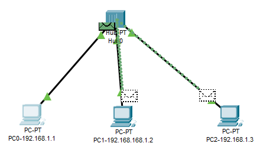

# Praktikum Komputer Jaringan

### Mengamati Proses Ping

#### 1. PC 0 Ke PC 1

Gambar di atas adalah isi arp sebelum dilakukan broadcast.

Setelah itu kita lakukan ping dari pc 0 ke pc 1. 

Terjadi broadcast ke seluruh pc yang ada.

#### 2. PC 0 Ke PC 1 Setelah Broadcast

Gambar di atas adalah isi arp setelah dilakukan broadcast. Dapat dilihat pc 0 menyimpan alamat tujuan ping sebelumnya yaitu alamat pc 1.

Setelah itu kita lakukan ping pc 0 ke pc 1.

Dan yang terjadi adalah adanya broadcast lagi ke semua pc yang ada.

#### 3. PC 1 Ke PC 0

Isi arp pada pc 1 menyimpan alamat ip pc 0.

Kita lakukan ping, dan yang terjadi adalah masih melakukan broadcast ke semua pc.
