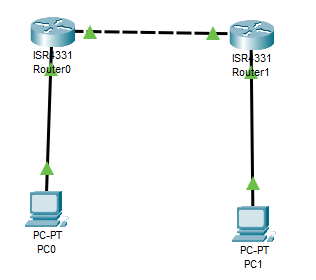
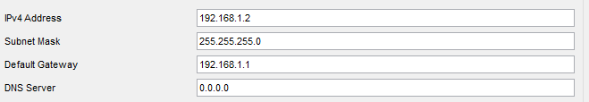
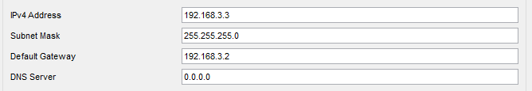
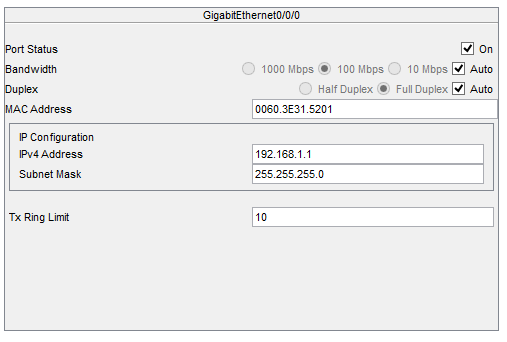
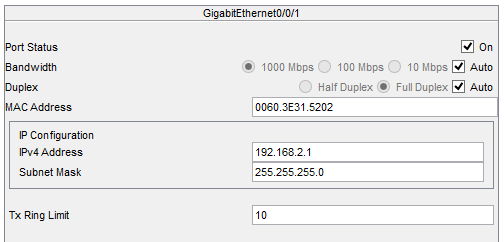
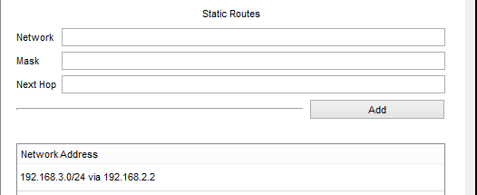
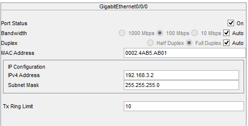
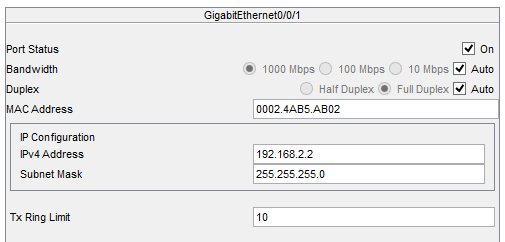
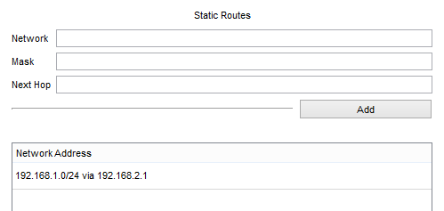
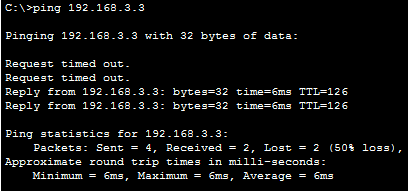

# Praktikum Komputer Jaringan

### Percobaan Menghubungkan Dua Perangkat Dengan Router

#### 1. Topologi Jaringan

Kita buat topologi jaringan seperti gambar di atas.

#### 2. Setting IP

Pengaturan ip pada pc 0

Pengaturan ip pada pc 0

Pengaturan ip pada router 0 port 0

Pengaturan ip pada router 0 port 1

Pengaturan table routing static pada router 0

Pengaturan ip pada router 1 port 0

Pengaturan ip pada router 1 port 1

Pengaturan table routing static pada router 1

#### 3. Percobaan PING

arp tidak menyimpan alamat ip pc 1

Hasil setelah ping, terjadi RTO sebanyak 2 kali setelah itu berhasil melakukan ping.
