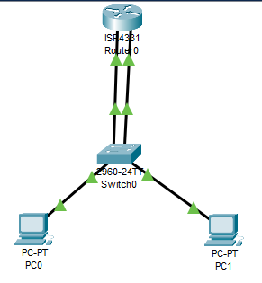
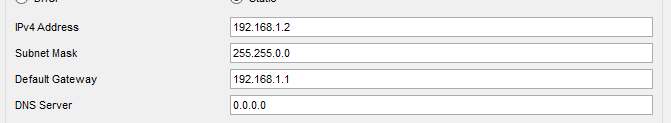
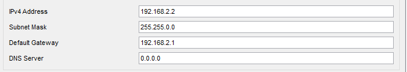
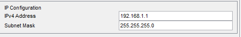
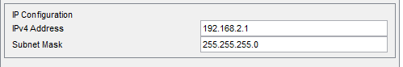
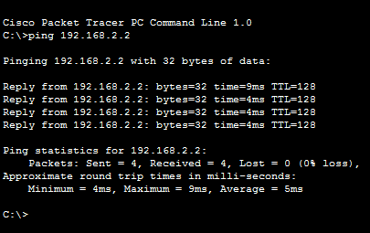

# Praktikum Komputer Jaringan

### Percobaan Vlan

#### 1. Topologi Jaringan

Kita buat topologi jaringan seperti gambar di atas.

#### 2. Setting IP

Pengaturan ip pada pc 0

Pengaturan ip pada pc 1

Pengaturan ip pada router 0 port 0

#### 3. Percobaan PING

Ping dapat dilakukan dari pc 0 ke pc 1.
