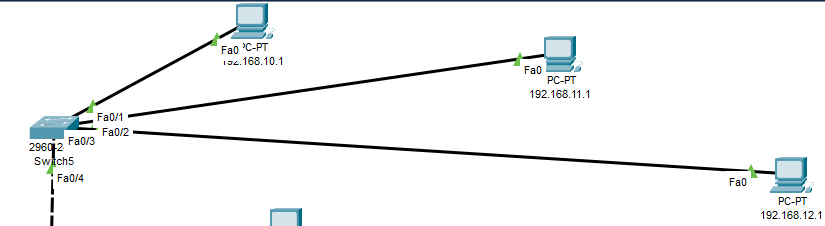
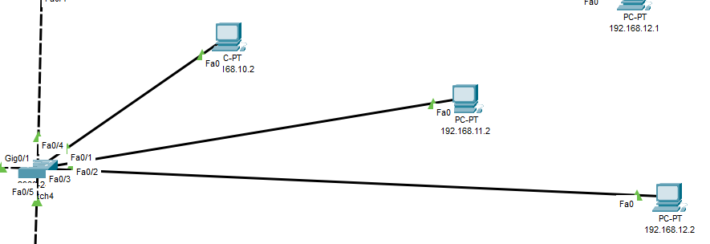
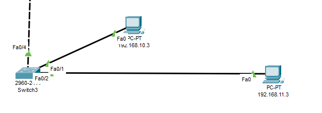
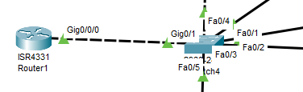
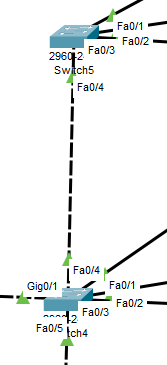
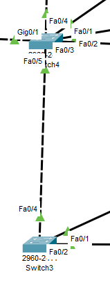
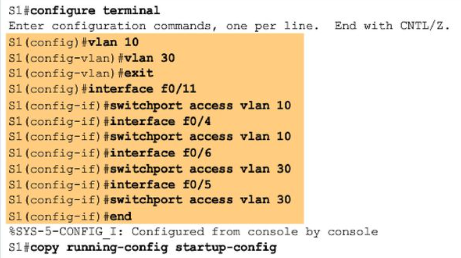
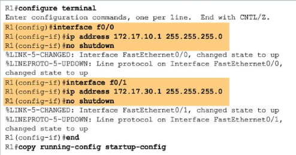
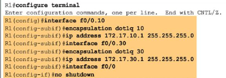

# Praktikum Konsep Jaringan

### Percobaan Vlan Tiga Lantai

#### 1. Topologi Jaringan

Kita buat topologi jaringan seperti gambar di atas.

#### 2. Setting IP

| PC |     IP      |
|---|--------------|
| 0 | 192.168.10.1 |
| 1 | 192.168.11.1 |
| 2 | 192.168.12.1 |
| 3 | 192.168.10.2 |
| 4 | 192.168.11.2 |
| 5 | 192.168.12.2 |
| 6 | 192.168.10.3 |
| 7 | 192.168.11.3 |

#### 3. Setting Router, Switch

