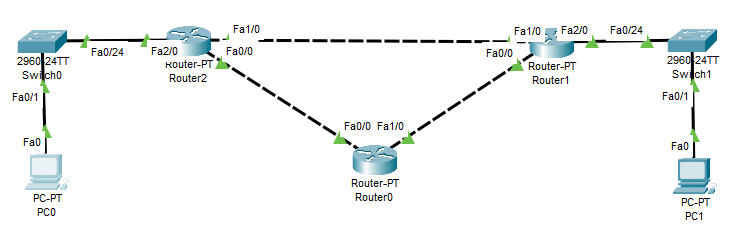
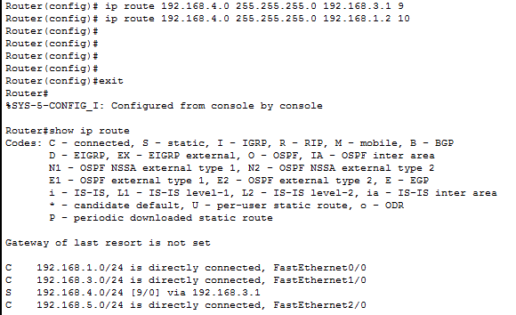
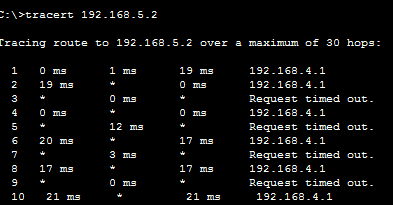

# Praktikum Konsep Jaringan

### Percobaan Static Routing

#### 1. Topologi Jaringan

Kita buat topologi jaringan seperti gambar di atas.

#### 2. Setting IP PC

| PC |     IP      | Default Gateway |
|----|-------------|-----------------|
|  0 | 192.168.4.2 |   192.168.4.1   |
|  1 | 192.168.5.2 |   192.168.5.0   | 

#### 3. Setting Interface Router

##### Router 2
| Interface |     IP      |
|-----------|-------------|
|     0     | 192.168.2.1 |
|     1     | 192.168.3.1 |
|     2     | 192.168.4.1 |

##### Router 1
| Interface |     IP      |
|-----------|-------------|
|     0     | 192.168.1.1 |
|     1     | 192.168.3.2 |
|     2     | 192.168.5.1 |

##### Router 0
| Interface |     IP      |
|-----------|-------------|
|     0     | 192.168.2.2 |
|     1     | 192.168.1.2 |

#### 4. Setting Static Routing
| Destination |    Netmask    |  Interface  |
|-------------|---------------|-------------|
| 192.168.5.0 | 255.255.255.0 | 192.168.3.2 |
| 192.168.4.0 | 255.255.255.0 | 192.168.3.1 |
| 192.168.4.0 | 255.255.255.0 | 192.168.2.1 |
| 192.168.5.0 | 255.255.255.0 | 192.168.1.1 |

