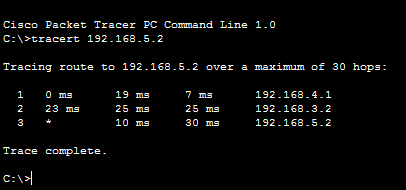

# Praktikum Konsep Jaringan

### Percobaan Dynamic Routing

#### 1. Topologi Jaringan

Topologi di atas sama seperti praktikum minggu 8 tetapi yang berbeda adalah penggunaan dynamic routing dengan RIP.

### 2. Konfigurasi IP PC

| Devices | Interface |     IP      |
| :-----: | :-------: | :---------: |
|   PC0   |   Fa0/0   | 192.168.4.2 |
|   PC1   |   Fa0/0   | 192.168.5.2 |

### 3. Konfigurasi IP Router

| Devices  | Interface |     IP      |
| :------: | :-------: | :---------: |
| Router 0 |   Fa0/0   | 192.168.2.2 |
|          |   Fa0/1   | 192.168.1.2 |
| Router 1 |   Fa0/0   | 192.168.1.1 |
|          |   Fa0/1   | 192.168.3.2 |
|          |   Fa0/2   | 192.168.4.1 |
| Router 2 |   Fa0/0   | 192.168.2.1 |
|          |   Fa0/1   | 192.168.3.1 |
|          |   Fa0/2   | 192.168.5.1 |

### 4. Konfigurasi Routing (RIP)

| Devices  |   Netowrk   |
| :------: | :---------: |
| Router 0 | 192.168.1.0 |
|          | 192.168.2.0 |
| Router 1 | 192.168.1.0 |
|          | 192.168.3.0 |
|          | 192.168.5.0 |
| Router 2 | 192.168.2.0 |
|          | 192.168.3.0 |
|          | 192.168.4.0 |

Perintah yang digunakan pada router 0 untuk mengaktifkan RIP:

        Router(config)#router rip
        Router(config-router)#network 192.168.1.0
        Router(config-router)#network 192.168.2.0

### 5. Testing Convergence Time And Routing RIP

Jalur yang dikirimkan dari PC0 ke PC1 adalah sebagai berikut:

1. PC0 mengirimkan paket ke router 1.
2. Router 2 menerima paket dan mengirimkan paket ke router 1.
3. Router 2 menerima paket dan mengirimkan paket ke PC1.
4. PC1 menerima paket.
